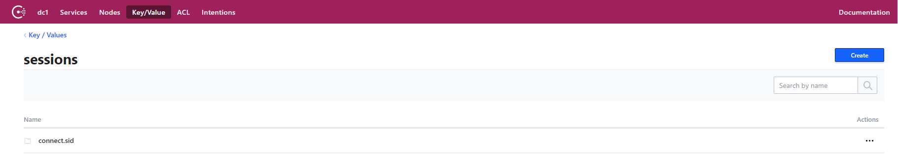
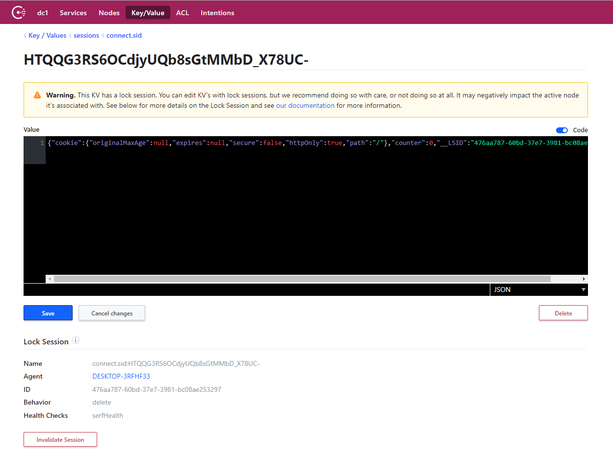
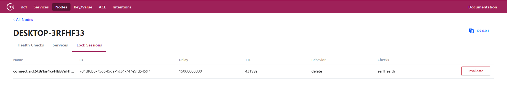

# connect-consul

This a session store library that uses the Consul ([HashiCorp](https://www.hashicorp.com)) key/value store. Requires [consul](https://www.consul.io/downloads.html)>=1.4.0.

About consul
-----


[Consul](https://www.consul.io) is a distributed service mesh to connect, secure, and configure services across any runtime platform and public or private cloud.

The consul has key/value storage, that used in this library for session store.

Consul [lock session](https://www.consul.io/docs/internals/sessions.html) is used for purposes of destroy the expired session store data by setting the TTL. Lock session also defines a [lock](https://www.consul.io/api/kv.html#acquire) for related keys.

Setup
-----

```sh
npm install connect-consul express-session
```

```js
var session = require('express-session');
var ConsulSessionStore = require('connect-consul')(session);

var opts = { };

app.use(session({
    store: new ConsulSessionStore(opts),
    secret: 'keyboard cat',
    resave: false
}));
```

Options
-----

* _opts.sessionsFolder_ - root folder name for session keys in KV Store ('_sessions_' by default)
* _opts.application_ - the application name used in sub-folder name, for instance 'connect.sid' and in lock session name as prefix, for instance 'connect.sid:HTQQG3RS6OCdjyU...' ('_connect_' by default)







* _opts.serializer_ - serializer for session store data (JSON by default)
* _opts.socket_ - null or [Consul](https://www.npmjs.com/package/consul) client instance value. If it has null value, will be created a new Consul client wich is used opts as parameter.
* _opts.debug_ - true, if need write [debug](https://www.npmjs.com/package/debug) messages to log (false by default)
* _opts.logger_ - an object that should implemented methods: debug, trace, info, warn, error (undefined by default)
* _opts.sessionBehavior_ - the consul session [behavior](https://www.consul.io/api/session.html#behavior) for KV stored values of lock session. The setting values: '[delete](https://www.consul.io/api/session.html#delete)', '[release](https://www.consul.io/api/session.html#release)' ('delete' by default)
